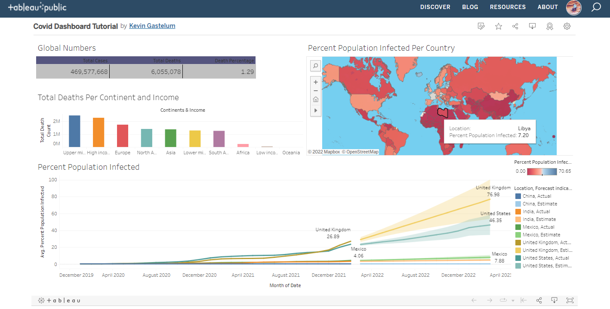
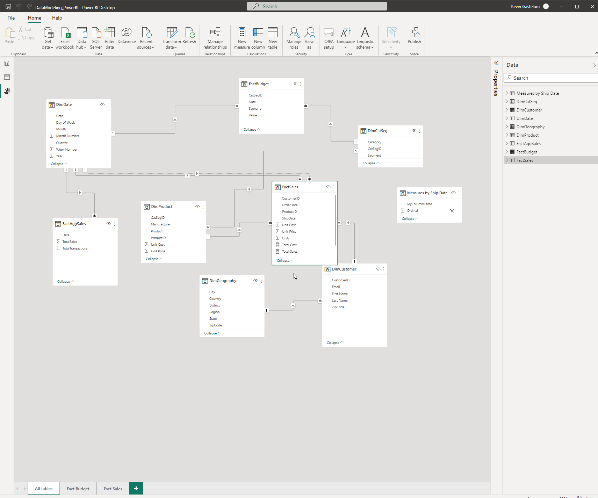
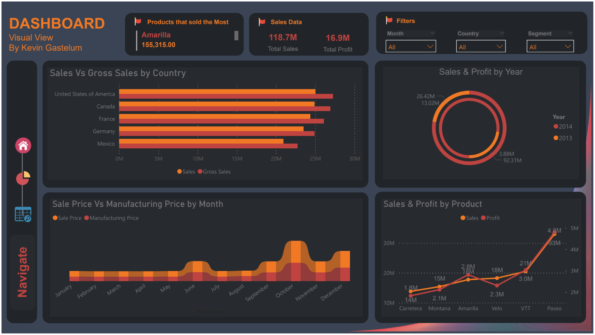
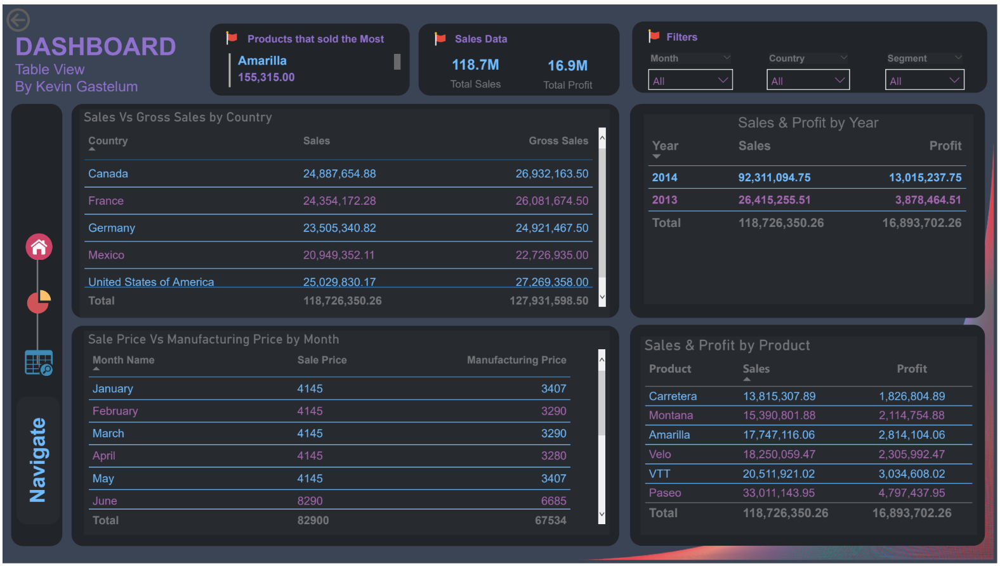
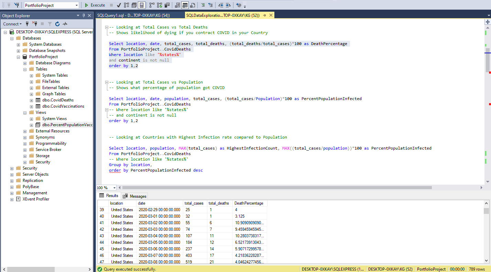
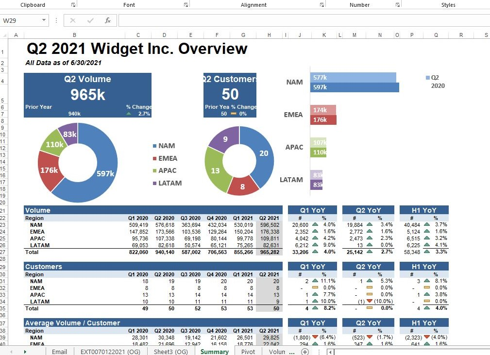

# My Data Analyst Projects

## Python WebApp Project #8 [[PDF AI/LLM (click here)]](https://kevingastelum-pdf-ai-app-app-se8ck0.streamlit.app/)

## Python WebApp Project #7 [[Breast Cancer Diagnosis ML (click here)]](https://kevingastelum-cancer-diagnosis-app-appmain-8rtucj.streamlit.app/)

## Python Website Project #6 [[Data Analyst Job Board (click here)]](https://kevingastelum.github.io/MyJobSearchSite/)

## Tableau Project (#5) [[Tableau Dashboard]](https://public.tableau.com/app/profile/kevin.gastelum/viz/CovidDashboardTutorial_16506786531500/Dashboard1)

<!-- Tableau Data Visualization Tutorial here:
https://www.youtube.com/watch?v=QILNlRvJlfQ&list=PLUaB-1hjhk8H48Pj32z4GZgGWyylqv85f&index=2&ab_channel=AlexTheAnalyst
-->

## Power BI Project (#4) [[Data Modeling in Power BI]](https://github.com/KevinGastelum/MyDataAnalysis/tree/main/5.%20PowerBi_Modeling)

## PowerBI Project (#3) [[Sales Dashboard]](https://app.powerbi.com/view?r=eyJrIjoiNDliMGExOGYtMmNkOC00ZmUwLWFjYWMtZTgwZDNmNTRhMTE5IiwidCI6ImYzM2I1YmU3LWVhZGQtNGUyNC1iMjI5LWFkNjBlN2FmOTZiOSJ9)

## SQL Project (#2) [[COVID-19 Data Exploration in SQL]](https://github.com/KevinGastelum/MyDataAnalystProjects/tree/main/2.%20COVID-19%20Data%20Exploration%20in%20SQL)
### Exploring Data in SQL using COVID-19 Deaths, Cases, Vaccinations, Countries, Population
COVID-19 Dataset:
https://ourworldindata.org/covid-deaths

<!--Completed following along Alex the Analyst Youtube Tutorial here:
https://www.youtube.com/watch?v=qfyynHBFOsM&list=PLUaB-1hjhk8H48Pj32z4GZgGWyylqv85f&index=1&ab_channel=AlexTheAnalyst
-->

## Excel Project (#1) [[Data Exploration & Analysis with Excel]](https://github.com/KevinGastelum/MyDataAnalystProjects/tree/main/1.%20Organizing%20Volume%20by%20Region)
<!--  -->

<!--Completed following Matt Brattin's Youtube series here:
  https://www.youtube.com/watch?v=45_yTM1HfTc&list=PL_WHfGYyPRuOWqablvZAw3iJHUoIGk7F3&index=2&ab_channel=MattBrattin
-->

<!--
## Tableau Project (#6)
### Create a full Data Analyst project using Tableau Tutorial here:
https://www.youtube.com/watch?v=zOR0-nygfDE&list=PLUaB-1hjhk8H48Pj32z4GZgGWyylqv85f&index=7&ab_channel=AlexTheAnalyst

## SQL Project (#6)
### SQL Data Cleaning Tutorial here:
https://www.youtube.com/watch?v=8rO7ztF4NtU&list=PLUaB-1hjhk8H48Pj32z4GZgGWyylqv85f&index=3&ab_channel=AlexTheAnalyst

## Python Project (#7)
### Data Correlation with Python Tutorial here:
https://www.youtube.com/watch?v=iPYVYBtUTyE&list=PLUaB-1hjhk8H48Pj32z4GZgGWyylqv85f&index=4&ab_channel=AlexTheAnalyst

## PySpark Project (#8)
### Pyspark tutorial from FreeCodeCamp here:
https://www.youtube.com/watch?v=_C8kWso4ne4&t=4099s&ab_channel=freeCodeCamp.org

-->

<!-- --><!-- --><!-- --><!-- --><!-- -->
<!-- --><!-- --><!-- --><!-- --><!-- -->
<!-- --><!-- --><!-- --><!-- --><!-- -->
<!-- --><!-- --><!-- --><!-- --><!-- -->
<!-- --><!-- --><!-- --><!-- --><!-- -->
<!-- --><!-- --><!-- --><!-- --><!-- -->
<!-- --><!-- --><!-- --><!-- --><!-- -->
<!-- --><!-- --><!-- --><!-- --><!-- -->
<!-- --><!-- --><!-- --><!-- --><!-- -->
<!-- --><!-- --><!-- --><!-- --><!-- -->
<!-- --><!-- --><!-- --><!-- --><!-- -->
<!-- --><!-- --><!-- --><!-- --><!-- -->
<!-- --><!-- --><!-- --><!-- --><!-- -->
<!-- --><!-- --><!-- --><!-- --><!-- -->
<!-- --><!-- --><!-- --><!-- --><!-- -->
<!-- --><!-- --><!-- --><!-- --><!-- -->
<!-- --><!-- --><!-- --><!-- --><!-- -->
<!-- --><!-- --><!-- --><!-- --><!-- -->
<!-- --><!-- --><!-- --><!-- --><!-- -->
<!-- --><!-- --><!-- --><!-- --><!-- -->
<!-- --><!-- --><!-- --><!-- --><!-- -->
